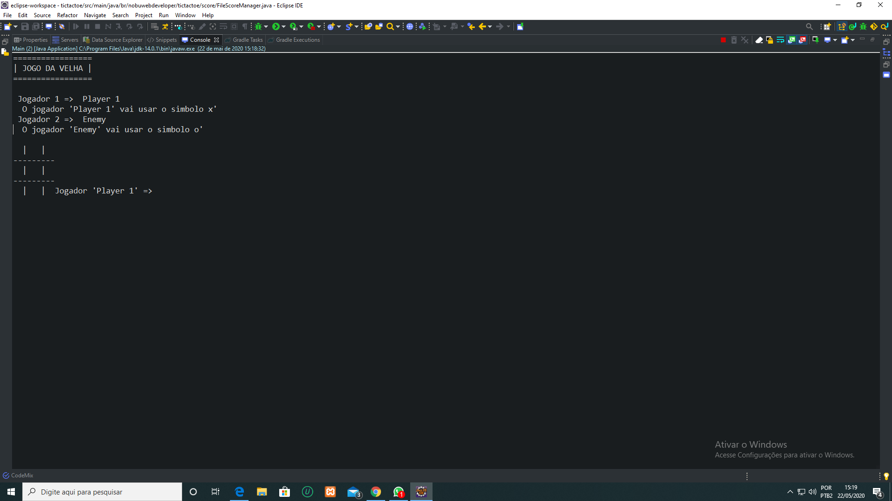
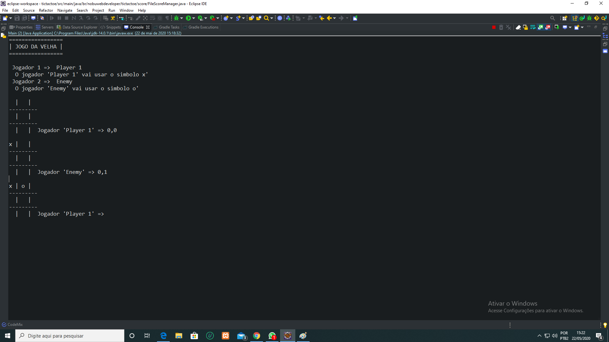
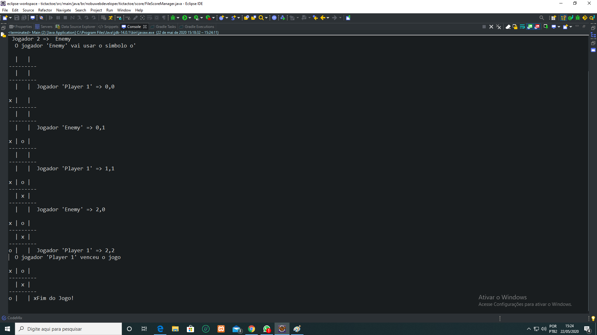
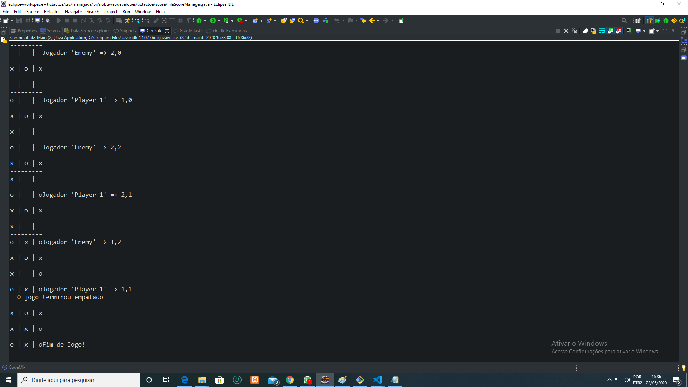
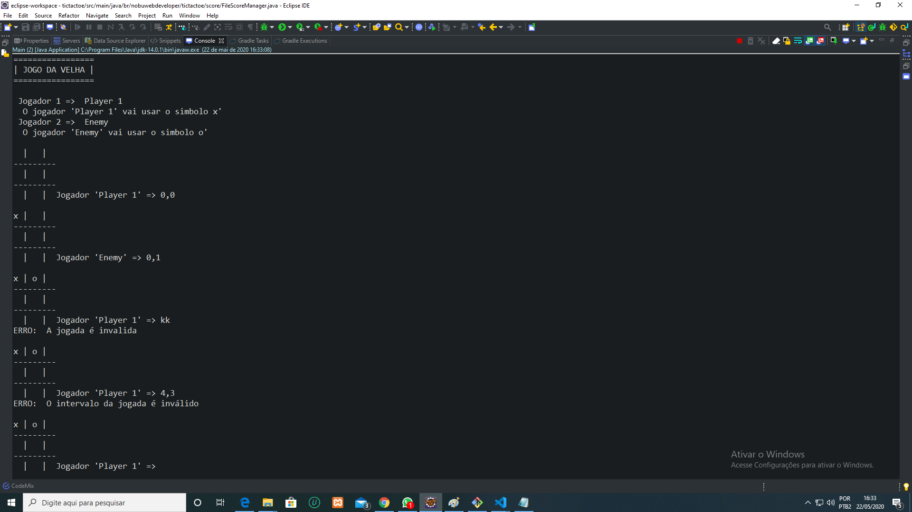

# Jogo-da-Velha
# Tic-Tac-Toe

## Desenvolvimento de um jogo da velha completo, explorando conceitos do Java e da programação orientada a objetos. ##

A finalidade deste projeto foi abordar o uso do paradigma de orientação a objetos.

 O game jogo da velha foi projetado para rodar no console (linha de comando). Embora seja um projeto simples ele é funcional e cumpre o seu objetivo, permitindo que duas pessoas possam jogar o jogo da velha através das informações impressas no console.

 Veja o funcionamento do Jogo da velha nas imagens abaixo:

 Imagem 1: Os jogadores Player 1 e Enemy inserem os seus nomes no console, e o sistema retorna com os símbolos atribuidos a cada jogador, neste exemplo o 'x' foi atribuido ao Player 1, e 'o' ao Jogador enemy.

Imagem 2: Nesta imagem o jogador insere a sua jogada na posição [0, 0] do array multidimensional eo símbolo x é registrado na memória e exibido na tela, em seguida o sistema pede para o jogador Enemy inserir a sua jogada, podemos observar que ele insere a sua jogada na posição [0, 1].

Para inserir jogadas neste game é muito simples, basta o usuário digitar o número da posição do array multidimensional desejada. O array que controla este jogo é um array de 'index[3, 3]'.

Imagem 3: Após qualquer dos usuários preencher as lacunas vertical, horizontal ou na diagonal vencerá o jogo e o sistema mostrará na tela uma mensagem, informando que o jagodor cadastrado cenceu o jogo.

